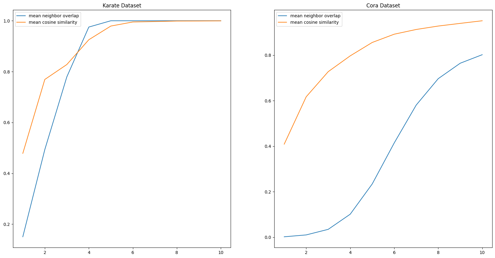
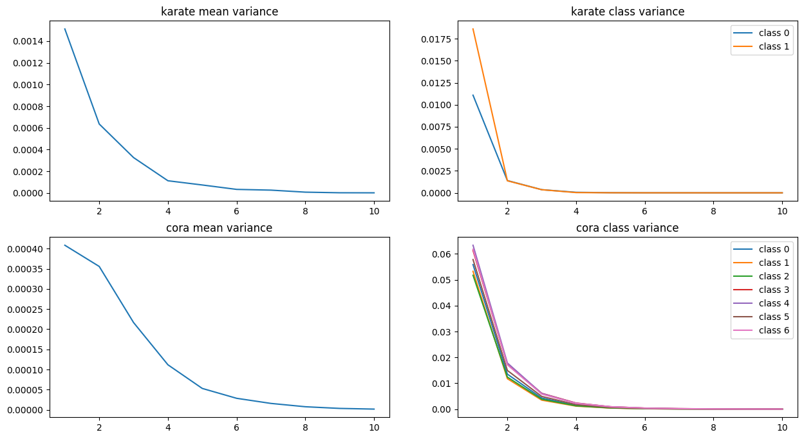

# CS471 Term Project
> Team number: 47.
> Members: 20190272 Junhyun Park, 20190605 Inho Jung, 20220554 Taeyoon Lee
## Finding the optimal layer depth in GCN for best performance.
---

## Introduction
In the lecture, we learned node features of GNNs tend to become more similar with the increase of the network depth. This is known as the **over-smoothing** problem. Intuituvely, as the depth of network grows, the range over which nodes exchange information widens. As learning processes, local information get diluted, and the importance of global information increases, leading to the similarity of feature vectors for much more nodes. This triggers a natural question: "How can we determine the depth of network to avoid the over-smoothing problem and optimize the learning process?"

In the case of GNNs, when the number of layers is $k$, then each node interacts with its $k$-hop neighborhoods. The extent of overlap between the $k$-hop neighborhoods of two nodes(receptive field) will determine how similar their feature vectors converge. We aim to investigate the relationship between the overlap of $k$-hop neighborhoods between nodes and the over-smoothing caused by network depth in GNNs.

- **Objective: Investigate how to find the optimal number of layers of GCN in which over-smoothing problem least occur and get optimal result.**

## Exp 1
Finding the correlation between $k$-hop neighborhood of nodes and feature vector smoothness.

### Details

- Define $k$-hop neighborhood of a node $v \in V$ as $N_k(v) = \{u \in V : \text{dist}(u, v) \le k\}$
- Define overlap between arbitrary two nodes $A, B \in V$ as $\text{overlap}=\frac{|N_k(A) \cap N_k(B)|}{|N_k(A) \cup N_k(B)|}$.
- How to define over-smootheness?
  - over-smoothing problem means feature vectors becoming indistinguishable.
  - Indistinguishability may be measured by cosine-similarity between vectors.
  - We compute the mean of cosine-similarity of all possible combinations of two nodes.
- Hypothesis:
  - Nodes in GCN with $k$ layers interacts with its $k$-hop neighborhood.
  - It is reasonable that $k$-hop neighborhood overlapping is highly related with its over-smoothing possibility.
- For the number of layers $k \in [1,10]$, compute the mean of $k$-hop neighbor overlap and the mean of cosine-similarity of feature vectors in all combinations of nodes.

### Results

We found a tendency that mean neighbor overlap and mean cosine similarity have similar shape, while it does NOT hold in sparse graph.

Furthermore, the curve of mean cosine similarity of feature vectors keeps its shape in both dense graph(Karate) and relatively sparse graph(Cora).

---

## Exp 2

* Motivation: In the exp 1 result, we found a tendency that two measurements are well-aligned in dense graph, while it does NOT hold in sparse graph.
* New hypothesis: The graph network (edge) density affects on the neighbor overlap or smoothness of feature vectors.

### Details
- We determined to make use of `Erdos-Renyi` model to generate various graphs in specified edge density. Refer to [here](https://en.wikipedia.org/wiki/Erd%C5%91s%E2%80%93R%C3%A9nyi_model).
- Two factors are considered: The number of nodes $|V|$ and the edge density $\rho=\frac{\epsilon}{|V|\choose2}$.
- Plot the line of measurements for all combinations of $|V|\in [50, 100, 250, 500]$ and $\rho \in [0.01, 0.02, 0.04, 0.06, 0.08, 0.1, 0.15, 0.2]$
  - It is based on the fact that graphs in real-world usually significantly sparse.

### Results

- Measurements become stable as $|V|$ increases.
- Neighbor overlap measurement grows much slower than the mean of cosine-similarities in sparse density.
- The overall mean of cosine-similarities on all combination of nodes cannot explain over-smoothness.
- Graph density does not significantly affect smoothing beyond a certain scale (most graphs around layers 2-4).
- The k-neighbor overlap(blue line) is significantly affected by density and is not suitable for explaining over-smoothing.
- From this fact, a new hypothesis arises: **the optimal point is at shallow layers (around layers 2-4)**, before a rapid increase of similarity.
  - **Limitation**: An increase in the overall mean of cosine similarities means all points converge in one direction, making classification difficult.
  - However, a lower cosine mean does not necessarily make classification easier; it does not explain the differences in class distributions.
  - For feature vectors to be useful for classification, class distributions should be distinguishable, meaning **the difference or variance between class means should be large, and the variance within a class should be small.**
---
## Exp 3

### Detail

- Using the Karate and Cora datasets, extract feature vectors by varying the number of GCN layers using the previous method.
- Divide feature vectors by class and calculate the mean and variance for each class.
- Let $C=\{C_1, C_2, ..., C_l\}$ be a set of classes of dataset. For each class $C_i$, compute its mean $\boldsymbol{\mu_i}$ and variance $\boldsymbol{\sigma_i^2}$ of the feature vectors of class $C_i$ nodes.
- Calculate norm of the variance of the means $\| \text{Var}(\boldsymbol{\mu_i}) \|$ and the L2 norm of the variance vectors $\| \boldsymbol{\sigma_i^2} \|$ of each class.
- Plot these values according to the number of layers.

### Result

- (Right) When plotting the class-wise variance vector norm $\| \boldsymbol{\sigma_i^2} \|$ by the number of layers, there is a sharp drop around layers 2. **Lower class variance promotes better classification result.**
- (Left) The variance of the class-wise mean vectors $\| \text{Var}(\boldsymbol{\mu_i}) \|$ does not decrease as sharply with more layers. **A lower variance of means is unfavorable for classification.**
- Therefore, it is ideal to limit the number of layers to where the variance norm drops the most sharply (layer 2 in both cases).

---

## Conclusion

- The overall $k$-hop neighborhood overlap of nodes may affect the cosine similarity of feature vectors.
- This tendency fits well in dense graph.
- However, the overall mean of cosine similarity cannot explain the ease of classification task.
- We investigated the classification task into two different points of view: closeness of mean vectors of classes, and vector variance in each class. To classify the classes easily, the mean vectors of class should be distinguishable and vector variance of each class should be lower.
- Class variance usually drops rapidly when the depth of network is shallow, while the mean variance shows relatively slower decrease. This can explain why GCN usually works well in shallow network depth.